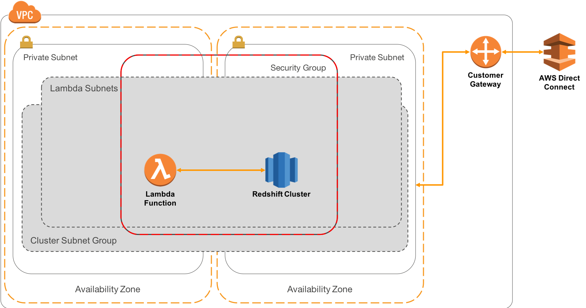
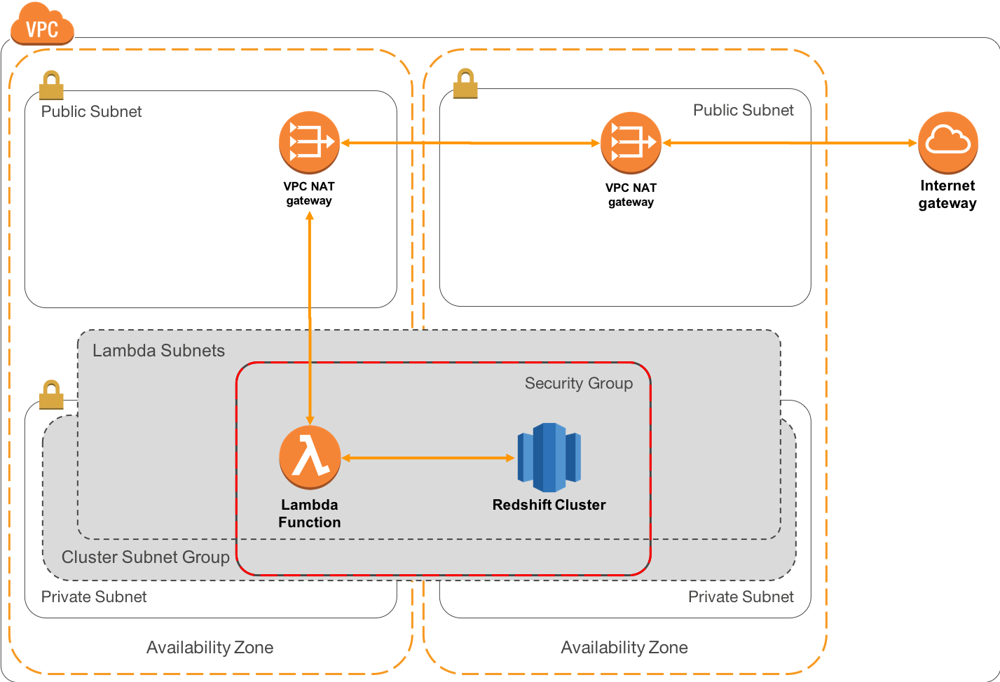

# Lambda Connections

## Overview

In this architecture, your AWS Lambda functions will connect only to resources that sit within public subnets of your VPC.

## Walkthrough of the Architecture

1. Amazon Redshift is run within Private Subnets as outlined in our [private connectivity pattern](https://github.com/aws-samples/aws-dbs-refarch-redshift/tree/master/private-routing).
2. AWS Lambda is configured to run in the same set of Subnets as the Redshift Cluster Subnet Group, which means when your Lambda function starts, it will have an ENI attached that egresses from your private Subnets. By default, private Subnets can route to each other and so connections to Redshift are simplified.
3. Your AWS Lambda functions should be configured to use the same VPC Security Group as the cluster, and this security group is configured to allow connections from itself on the Redshift port only.

In this architecture, your Lambda functions will have no connectivity possible outside of the VPC, and so will have to solve the problem of secure storage of the database password. It is not recommended that you put database passwords into [Encrypted Lambda Environment Variables](https://docs.aws.amazon.com/lambda/latest/dg/env_variables.html#env_encrypt), as these will be visible to anyone who can edit the function. It is for this reason that most customers opt to give Lambda functions the ability to route to AWS services:

## Connecting Lambda Functions to services outside of VPC

As with the previous architecture, your Redshift cluster runs in private Subnets and connections are routed back through a Customer Gateway and AWSDirect Connect.

1. However, we also add public subnets which contain [AWS VPC NAT Gateways](https://docs.aws.amazon.com/AmazonVPC/latest/UserGuide/vpc-nat-gateway.html). These sit within each AZ and allow outbound traffic to be routed via an Internet Gateway. This will allow for the storage of database passwords in the [AWS Systems Manager Parameter Store](https://aws.amazon.com/blogs/compute/sharing-secrets-with-aws-lambda-using-aws-systems-manager-parameter-store). For java functions, you can also consider using [Redshift IAM Single Sign On](http://docs.aws.amazon.com/redshift/latest/mgmt/generating-user-credentials.html).
