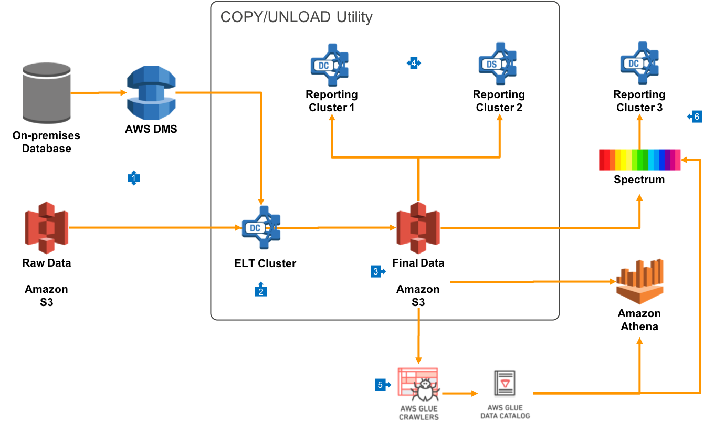

# Business Line Data Warehouses

## Overview

This architecture provides you with the ability to run multiple Redshift Data Warehouses that are each sized to meet the requirements of separate groups of end users. You may create these clusters based on Business Units, or based upon how your end users use the data. For example, some users just need prebuilt reports, where others require deep ad-hoc analysis against all your data.

## Walkthrough of the Architecture

1. In this architecture, all your raw data is received into a primary cluster which is used for Extract/Load/Transform operations. This will include receiving raw data feeds from Amazon S3, but also may include on-premises RDBMS data being replicated into Redshift with AWS [Data Migration Service (DMS)](https://aws.amazon.com/dms).
2. Data in your primary cluster is transformed using 'pushdown SQL' operations, where data is manipulated in bulk using SQL statements directly, or through views. This will take advantage of the massively parallel nature of Redshift to transform the data, and may be done through a scheduler or a third-party ETL tool like [Talend](https://aws.amazon.com/marketplace/seller-profile?id=94c7a8d1-1a64-4a59-b364-9248619fb75f) or [Matillion](https://aws.amazon.com/marketplace/pp/B010ED5YF8?qid=1524495459622&sr=0-2&ref_=srh_res_product_image).
3. The [Redshift UNLOAD/COPY utility](https://github.com/awslabs/amazon-redshift-utils/tree/master/src/UnloadCopyUtility) can be used to export a copy of data after transformation to a form suitable for query analysis. This data should be compressed, and will typically take the form of a separate S3 prefix per table, and then additional prefixes for date based partitions. It's a best practice to create separate prefixes for Year, Month and Day. If you use [Hive Dynamic Partition](https://cwiki.apache.org/confluence/display/Hive/DynamicPartitions) notation in the S3 prefix structure (of the form `/PartitionColumnName=PartitionValue/`, then partitions will be automatically recognised by most query tools.
4. Data can be loaded using the UNLOAD/COPY utility into any number of additional Redshift clusters. Each of these clusters can select a [node type and count](https://docs.aws.amazon.com/redshift/latest/mgmt/working-with-clusters.html#rs-about-clusters-and-nodes) that meet the needs of the particular business unit.
5. Final data in S3 should be analyzed by [AWS Glue Crawlers](https://docs.aws.amazon.com/glue/latest/dg/add-crawler.html) on a periodic basis, and it will be entered into the Glue Data Catalog.
6. The same final data that is loaded directly into multiple business line clusters can also be presented to a group of end users via raw queries using S3 data via Redshift Spectrum. This is a good option if users of this cluster have a read-only use case and local storage is not required.
