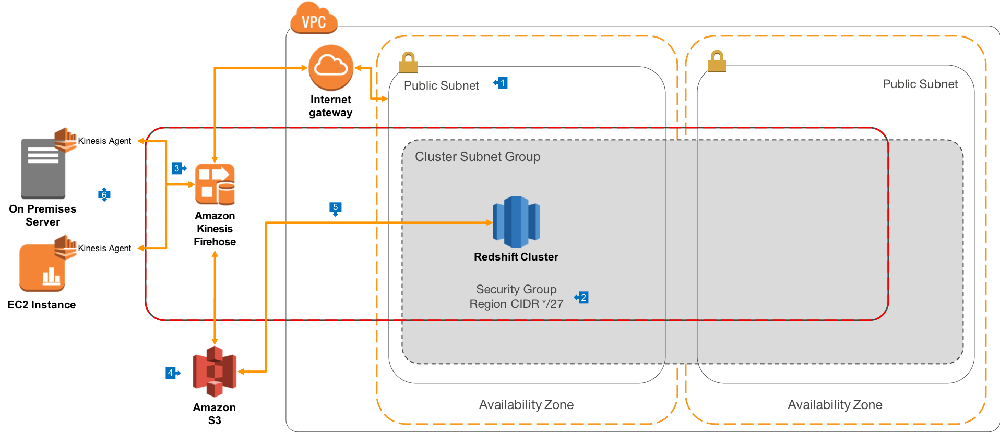

# Loading data with Kinesis Data Firehose

[Kinesis Data Firehose](https://aws.amazon.com/kinesis/data-firehose) is the easiest way to load streaming data into data stores and analytics tools. It can capture, transform, and load streaming data into Amazon S3, Amazon Redshift, Amazon Elasticsearch Service, and Splunk, enabling near real-time analytics with existing business intelligence tools and dashboards you’re already using today. It is a fully managed service that automatically scales to match the throughput of your data and requires no ongoing administration. It can also batch, compress, transform, and encrypt the data before loading it, minimizing the amount of storage used at the destination and increasing security.

## Overview

This architecture allows for serverless, fully managed data loading of streaming data to Amazon S3 and Redshift, and can also be extended to support loading application logfiles from configured hosts.

## Walkthrough of the Architecture

1. In this architecture, we use the [public routing](../public-routing) model for network deployment
2. Redshift is deployed to a Public Subnet, and the Cluster Security Group is configured to [allow inbound connections from Kinesis Data Firehose](https://docs.aws.amazon.com/firehose/latest/dev/controlling-access.html#using-iam-rs)
3. A Delivery Stream is configured in Kinesis Data Firehose with a target of the Redshift cluster we want to load. In this configuration, we specify how frequently data loads should occur, and/or what the maximum size of loaded files should be. We can configure compression of the data files (recommended) as well as configure the encryption requirements for the data while it is in flight and when stored on Amazon S3. You can also [configure data transformations](https://docs.aws.amazon.com/firehose/latest/dev/data-transformation.html) to occur using AWS Lambda.
4. The Firehose Delivery Stream first stages load data to Amazon S3 in the format specified during configuration
5. Firehose then connects to the cluster, and issues the [COPY command](https://docs.aws.amazon.com/redshift/latest/dg/t_Loading-data-from-S3.html) using a Load Manifest, which causes the cluster to pull the data from Amazon S3 in an optimally parallel fashion.
6. If you want to load file based data, you can configure the [Kinesis Agent](https://github.com/awslabs/amazon-kinesis-agent) on hosts which contain files you want to load into Redshift. This configuration can also include [pre-processing rules](https://aws.amazon.com/blogs/aws/amazon-kinesis-agent-update-new-data-preprocessing-features) to standardize logfile lines into a loadable format.

This architecture will load any type of streaming data that is pushed to the Kinesis Data Firehose Delivery Stream, and you can also create streaming applications that process data from Kinesis Data Streams. [These Data Streams can then be used as the source for a Firehose Delivery Stream.](https://docs.aws.amazon.com/firehose/latest/dev/writing-with-kinesis-streams.html)
