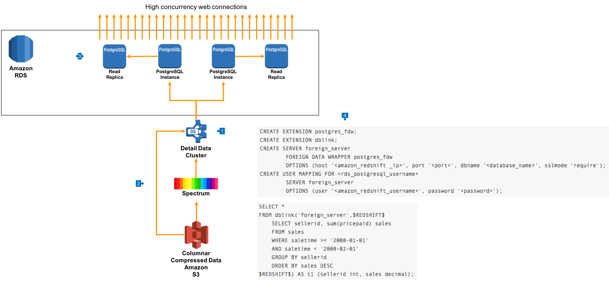

# High Performance Hybrid Data Warehouse

## Overview

This architecture is used for cases where you need to support many thousands of concurrent connections with low single-digit millisecond performance. This is often used for architectures where anlaaytics data is public facing on websites or through software applications.



## Walkthrough of the Architecture

1. In this architecture, your cluster is created as normal, and most likely will use the [private](https://github.com/aws-samples/aws-dbs-refarch-redshift/tree/master/private-routing) or [proxy](https://github.com/aws-samples/aws-dbs-refarch-redshift/tree/master/public-routing) routing network deployments
2. Data is ingested directly into the cluster via the COPY command, and data can also be referenced through [external Redshift Spectrum tables](https://github.com/aws-samples/aws-dbs-refarch-redshift/tree/master/spectrum-multicluster)
3. Using Amazon RDS, we create an Aurora Postgres cluster fleet, which exposes a primary database that can be written to, as well as up to 15 Read Replicas which are automatically syncronised to the primary. This cluster can be [configured to autoscale](https://docs.aws.amazon.com/AmazonRDS/latest/UserGuide/Aurora.Integrating.AutoScaling.html) based on a variety of performance metrics, and in this architecture we'd expect to use query rate or connection count for scaling.
4. We then use Postgres features to connect to our Redshift cluster using the Postgres Driver, via a database link. Use the following commands to create the connection to the Redshift cluster from the Aurora Primary:

```
CREATE EXTENSION postgres_fdw;
CREATE EXTENSION dblink;
CREATE SERVER foreign_server
        FOREIGN DATA WRAPPER postgres_fdw
        OPTIONS (host '<amazon_redshift _ip>', port '<port>', dbname '<database_name>', sslmode 'require');
CREATE USER MAPPING FOR <rds_postgresql_username>
        SERVER foreign_server
        OPTIONS (user '<amazon_redshift_username>', password '<password>');
```

You can view data in the remote Redshift cluster using simple SQL statements such as:

```
SELECT *
FROM dblink('foreign_server',$REDSHIFT$
    SELECT sellerid, sum(pricepaid) sales
    FROM sales 
    WHERE saletime >= '2008-01-01' 
    AND saletime < '2008-02-01' 
    GROUP BY sellerid 
    ORDER BY sales DESC
$REDSHIFT$) AS t1 (sellerid int, sales decimal);
```

In this architecture, we expect to store raw detail data in the Redshift cluster, where we get significant benefit by using columnar compression, In RDS Postgres Aurora, we store aggregated data that can be served to our applications in a format that is optimised for queries being run. An example of a simple way to automate this process is to embed SQL such as the above in [Postgres Materialised Views](https://www.postgresql.org/docs/9.3/static/rules-materializedviews.html).

## Learn More

__Enabling RDS Postgres federation to Amazon Redshift__: https://aws.amazon.com/blogs/big-data/join-amazon-redshift-and-amazon-rds-postgresql-with-dblink 
