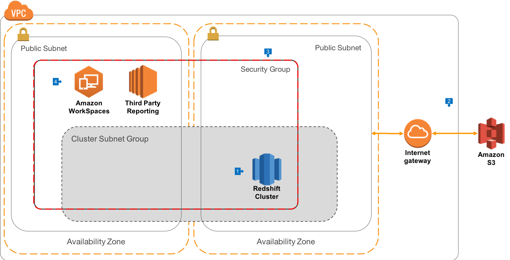
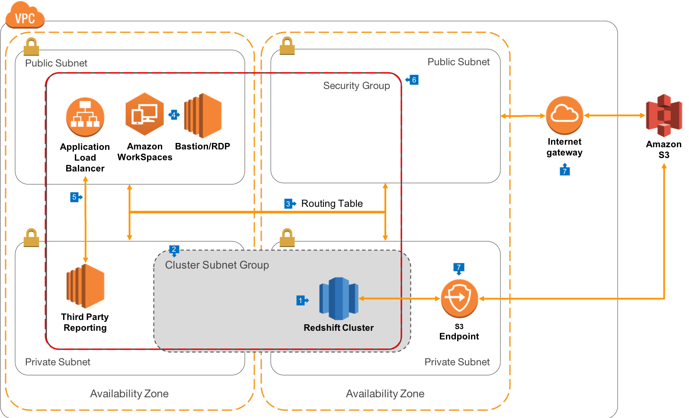

# Data Warehouse deployment architecture to support connections from anywhere

## Public Routing - Overview

This the most basic architecture that we recommend to be used with Amazon Redshift, where connections are routed into [Amazon Virtual Private Cloud (VPC)](https://aws.amazon.com/vpc) via routing to public IP addresses. Use this architecture when you want a simple environment for connecting end users without setting up DirectConnect*.

## Walkthrough of the Architecture

1. In this architecture, we deploy Redshift to VPC, as will be the case for all our other architectures. Redshift is created in a public VPC Subnet in the AZ of your choice
2. In order to create the cluster, we must configure a [Cluster Subnet Group](https://docs.aws.amazon.com/redshift/latest/mgmt/working-with-cluster-subnet-groups.html), which identifies the list of subnets where we want to run the cluster. It is a best practice _to create cluster Subnet Groups that span [Availability Zones (AZ)](https://docs.aws.amazon.com/AWSEC2/latest/UserGuide/using-regions-availability-zones.html)_. In the extremely unlikely case that an AZ goes offline, having your Cluster Subnet Group span AZ's will make it very easy to replace the cluster in another AZ with the same security architecture and routing rules. This diagram shows just 2 AZ's, but you can extend across as many AZ's as you wish to use in a Region. Your VPC has an Internet Gateway attached, and connections for your Routing table send all 0.0.0.0/0 traffic to the Internet Gateway
3. The Redshift Security Group is configured to allow connections only from itself, as well as any CIDR blocks you would like to configure for your office locations, where direct database connections are used
3. Connections to your environment can be made by your end users using [Amazon Workspaces](https://aws.amazon.com/workspaces), a powerful Virtual Desktop Interface (VDI) in the Cloud. This gives you the ability to present all of your third party reporting tools via a managed applicaiton environment. You may also offer [Bastion Hosts](https://docs.aws.amazon.com/quickstart/latest/linux-bastion/architecture.html) or Remote Desktop based Instances using EC2 in order to administer your environment.

## Proxy Routing - Overview
This the most basic architecture that we recommend to be used with Amazon Redshift, where connections are routed into [Amazon Virtual Private Cloud (VPC)](https://aws.amazon.com/vpc) via routing to public IP addresses. Use this architecture when you want a simple environment for connecting end users without setting up DirectConnect.

## Walkthrough of the Architecture

1. In this architecture, rather than deploying to public subnets, we recommend that Redshift be run in private subnets, which gives you the maximum security and control over how connections are made to the Cluster.
2. In this architeture, our Cluster Subnet group spans only the private subnets in our VPC
3. For this architecture, you'll [create a more advanced VPC Routing Table](https://docs.aws.amazon.com/AmazonVPC/latest/UserGuide/VPC_Scenario2.html) that will allow connections to resources in Public Subnets from the Internet Gateway, but only allow connections to the Private Subnets from Public Subnets.
4. As with the previous architecture, connections by end users can be made via Amazon Workspaces, or Bastion hosts. In this architectre, direct external connections to the Redshift cluster must be tunneled via SSH, which provides an extra level of security and authentication for connections from outside the VPC. Most advanced query tools support SSH tunnels.
5. Web connections made from your end users will terminate on an [Application Load Balancer (ALB)](https://docs.aws.amazon.com/elasticloadbalancing/latest/application/introduction.html) which is presented in a Public Subnet. This allows your third-party reporting servers (such as Tableau or Looker) to be deployed into Private Subnets, and increases the control you have over where connections originate and how they are handled. In some cases, the third-party software vendor may not support ALB, in which case you can use a Classic Load Balancer (ELB) instead.
6. Your Redshift Cluster, Reporting Server, Workspaces, Bastion/RDP Hosts and ALB can all share a [VPC Security Group](https://docs.aws.amazon.com/AmazonVPC/latest/UserGuide/VPC_SecurityGroups.html), which is a software filewall that allows connections only from members of the group, and on only the ports that you configure.
7. When Redshift connects to Amazon S3, it will route out of your VPC via an Internet Gateway, where it will then hit the S3 endpoint for the specified region.

## Best Practices

Please NOTE that with the public routing architecture, you will assign your Redshift cluster a public IP address. It is important to use Redshift's security features to ensure that only authorised users access the cluster. You should:

* Use VPC and/or EC2 Security Groups to only authorised expected CIDR blocks to create inbound connections, and only using the configured Redshift port (default 5439)
* Configure encryption in transit using SSL only client connections
* Consider configuring non-VPC based connections to use the Redshift-IAM SSO authentication feature, where authorisation to Redshift is performed via your Corporate Identity Provider (such as Microsoft Active Directory or LDAP) and only temporary access credentials are granted to end users.
