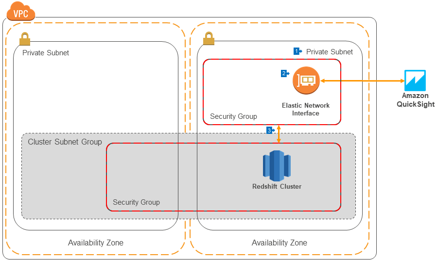

# Integration with Amazon QuickSight

## Overview

[Amazon QuickSight](https://aws.amazon.com/quicksight) is a fast, cloud-powered business analytics service that makes it easy to build visualizations, perform ad-hoc analysis, and quickly get business insights from your data.

QuickSight natively integrates with Redshift [(and other data sources)](https://docs.aws.amazon.com/quicksight/latest/user/supported-data-sources.html) clusters in the same account as you've provisioned.

## Walkthrough of the Architecture

1. The deployment architecture used for QuickSight integration is similar as for [private routing](../private-routing). Redshift is deployed into a Private Subnet in your VPC, with a Cluster Subnet Group that spans all Private Subnets in your VPC.
2. QuickSight deploys an Elastic Network Interface into a Security Group and Subnet of your choosing. Communication between QuickSight and your data sources will be through this interface, so it must be in a subnet that can route traffic to any data sources you want to connect to.
3. The Security Group of the Redshift cluster is configured to allow inbound traffic from the Security Group of the Elastic Network Interface. The Security Group of the Elastic Network Interface must be configured to allow both inbound and outbound traffic to the Redshift cluster's Security Group.

## Learn More

You can learn more by following this [step-by-step guide](https://docs.aws.amazon.com/quicksight/latest/user/working-with-aws-vpc.html).
