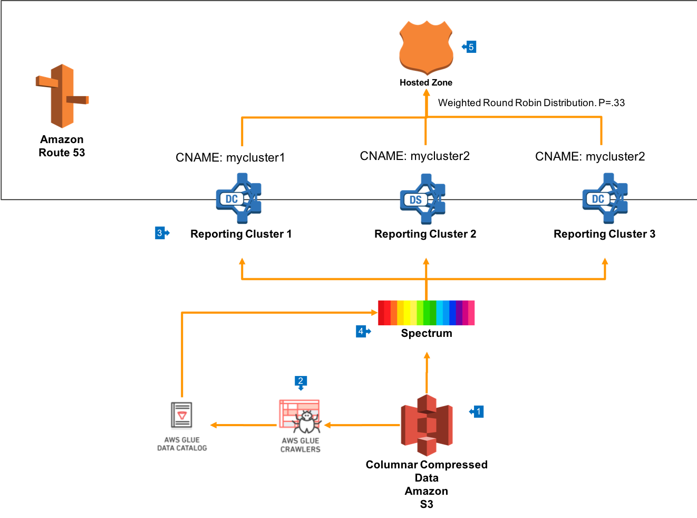

# Multi-Warehouse Architecture leveraging Redshift Spectrum

## Overview

[Redshift Spectrum](https://aws.amazon.com/redshift/spectrum) enables you to run Amazon Redshift SQL queries against exabytes of data in Amazon S3, and supports both structured and unstructured data. In this architecture, we'll see how we can leverage Redshift Spectrum to enable scale-out of unlimited size with a single unified endpoint.

## Walkthrough of the Architecture

1. In this architecture, your data is stored on Amazon S3 in an columnar compressed format such as [Orc or Parquet](https://docs.aws.amazon.com/redshift/latest/dg/c-spectrum-data-files.html). This data will be organised using a S3 prefix structure that enables easy navigation by business unit, as well as providing for simple security rules in S3. 
2. This compressed data will be crawled by AWS Glue Crawlers and entered into the AWS Glue Data Catalog. This will include all the relevant file attributes to create a table, as well as [containing references to Hive Partitions based on S3 prefixes](https://docs.aws.amazon.com/glue/latest/dg/aws-glue-programming-etl-partitions.html).
3. Create multiple Redshift Clusters, each sized for the capacity that you need to deliver to one set of end users. These clusters will typically be of heterogenous size and instance type, but can differ depending on use.
4. [Create Redshift Spectrum External Schemas](https://docs.aws.amazon.com/redshift/latest/dg/c-spectrum-external-schemas.html) in each reporting cluster which allow access to data in S3 via Glue Data Catalog.
5. If heterogenous cluster configurations are used, then it can also be useful to create a [Route53 Hosted Zone](https://docs.aws.amazon.com/Route53/latest/DeveloperGuide/CreatingHostedZone.html) which provides simple DNS names for each of the clusters. This can be used to expose each cluster to end users, as well as providing a single endpoint which is used to load balance across all clusters in the group.

## Learn More

__Top 10 Best Practices for Redshift Spectrum__: https://aws.amazon.com/blogs/big-data/10-best-practices-for-amazon-redshift-spectrum

