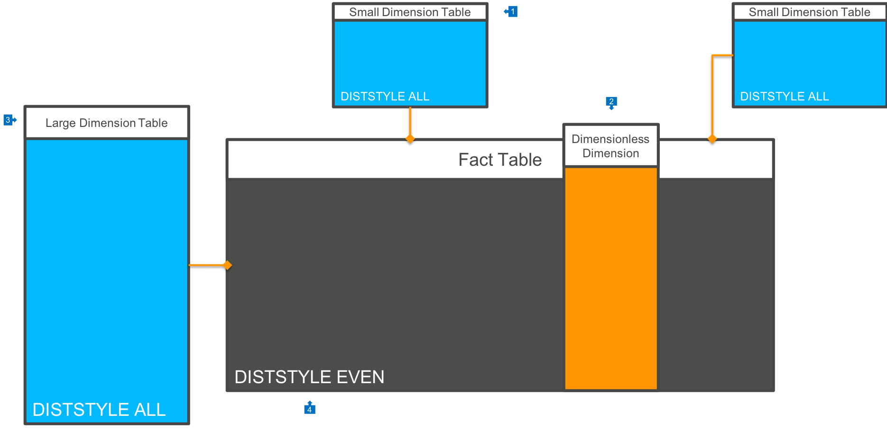
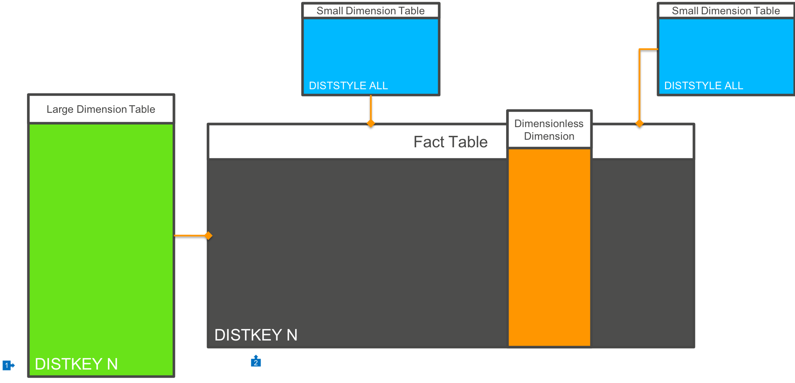
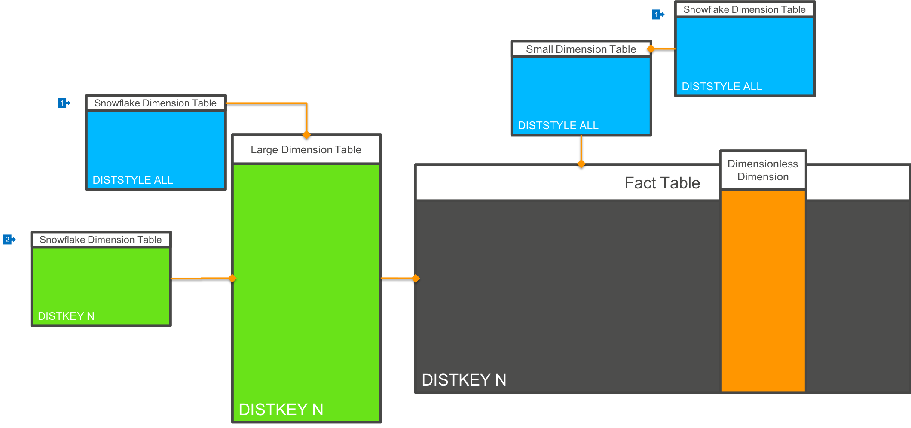

# Star Schema

[Star schema](https://en.wikipedia.org/wiki/Star_schema) is a data modelling technique where business data is divided into Facts, or events that occured in the business, and Dimensions, which are pieces of business data that describe the details of each Fact. A Fact table contains references to Dimension tables using surrogate keys, as well as the Measures of the event, such as amounts, durations, timestamps of when the event occurred, and so on.

This technique is ideal for data warehousing systems such as Amazon Redshift that employ columnar compression. Fact tables are comprised of a set of surrogate key columns for Dimensions whose cardinality is significantly lower than that of the Fact table - where a Fact table may have tens of billions of rows, the Dimension keys may only have 10's of thousands of unique values. Columnar compression allows the database to store these low cardinality values very efficiently, making our Fact table much smaller than it would be if row storage was used.

## Distributing Data

In a distributed database like Amazon Redshift, you can control how data is distributed across all nodes in the cluster. The possible options include:

* `EVEN`: Data is evenly distributed across nodes in the cluster, and each node should end up with the same amount of data
* `ALL`: A single copy of data is placed onto each physical node where other data is stored
* `KEY`: Data is distributed to nodes in the cluster using a hash of a column that you specify.

Please review the [Choosing a Distribution Style](https://docs.aws.amazon.com/redshift/latest/dg/t_Distributing_data.html) documentation for more information.

## Best practices for distribution of Star Schemas in Redshift

### Default Distribution Approach

If you don't know how to distribute your Star Schema model for Redshift, then you can use the following simple rules:

1. Small Dimension tables should be marked as `DISTSTYLE ALL`, which will cause them to be replicated to each physical node in the cluster.
2. Wherever possible, denormalise single dimension values onto the Fact table. An example of this would be a postal code, if you do not need to store any additional information about each postal code value. This would be in contrast to using an 'Address' Dimension.
3. Large Dimension tables are also marked as `DISTSTYLE ALL`.
4. Fact tables are marked as `DISTSTYLE EVEN`, which will cause data to be placed onto each [Slice](https://docs.aws.amazon.com/redshift/latest/dg/c_high_level_system_architecture.html) in the cluster evenly.

This architecture will result in each join between Fact and Dimension tables to be performed only within each Slice, and no data will have to be broadcast across the cluster between Slices.

However, for very frequently updated Dimension tables, or where you have a very large volume of data in Dimension tables, this can result in more storage space used, as well as higher latency to make updates of Dimension values (as each node must be updated).

### Key Based Distribution Approach

In some cases, your analysis will be done on the basis of a primary Dimension - for example a particular schema which is optimised for Customer analysis. If the  vast majority of your queries join on a single Dimension, or if you have a Dimension which is very large (some can almost look like Fact tables in their own right!), then you may wish to distribute data by this Dimension key:

1. In this model we have a very large Dimension table, and we distribute the Dimension table by it's primary key value
2. The Fact table is also distributed by this Dimension key column value.

In this model, all joins between the primary Dimension table and the Fact table will be colocated at the Slice level. Other Dimension tables are `DISTSTYLE ALL` and joins are also Slice colocated. If there are Dimension tables that are distributed based on a different key value, then network broadcast will occur.

### Snowflaking

"Snowflaking" is the term used to describe a case where a Dimension table requires joining to another table to provide complete information in the context of a query:

1. In most cases, you will want to mark related Dimension tables (the Snowflakes) as `DISTSTYLE ALL`, so that they are distributed to each node in the cluster
2. However, in some cases, and particularly if you are using Key based distribution of a large Dimension and Fact combination, it may be possible to also distribute these related lookup tables by the same key value. 

Because of columnar compression, denormalising key values onto 'parent' tables is relatively inexpensive to store, and can provide significant performance improvements. However, this can only be used if the cardinality of the Snowflake table to the Dimension table is 1:1 or M:N.

## Data Sorting

With Amazon Redshift, in addition to dictating how data is distributed to each Slice, you can also control how data is physically organised on disk. This is called Sorting, and you can read more about [sorting data here](https://docs.aws.amazon.com/redshift/latest/dg/t_Sorting_data.html).

Best practices for data sorting are:

* Choose a `SORT KEY` which appears in where clauses of queries often. Redshift will use this information to only access data blocks that contain information relevant to the query. In most cases, this will be a date/time oriented value, which helps us restrict queries only to the most relevant rows. In most Fact tables this a clear an obvious choice.
* If your table is most commonly joined to a primary Dimension, then include the Dimension key column in the Sort Key at a secondary position (not the first column)
* If your table is *always) joined to a primary Dimension, then you will probably have distributed the Fact and Dimension tables by this value. If you restrict the range of Dimension values heavily, then you may want to place this key column in the first position of the Sort Key.

